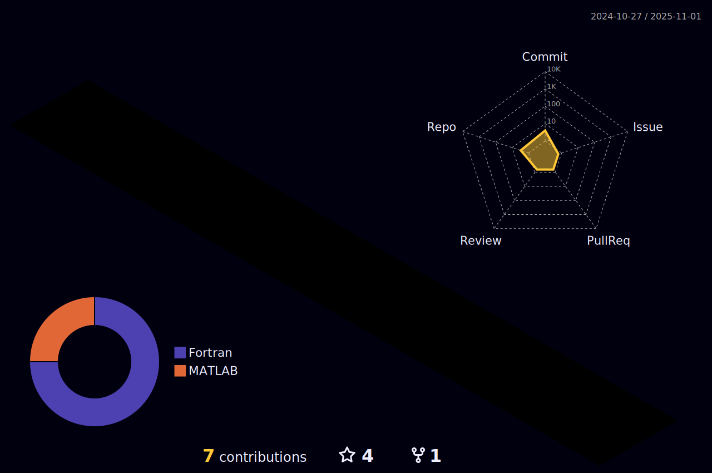

- I’m interested in neural networks with applications in physical and chemical sciences. Also, I have interest in integral equation theories applied to liquid state physics.
- I’m also interested in Python, C, C++ and CUDA.

<!---

--->

<!---
CarvFS/CarvFS is a ✨ special ✨ repository because its `README.md` (this file) appears on your GitHub profile.
You can click the Preview link to take a look at your changes.
--->
